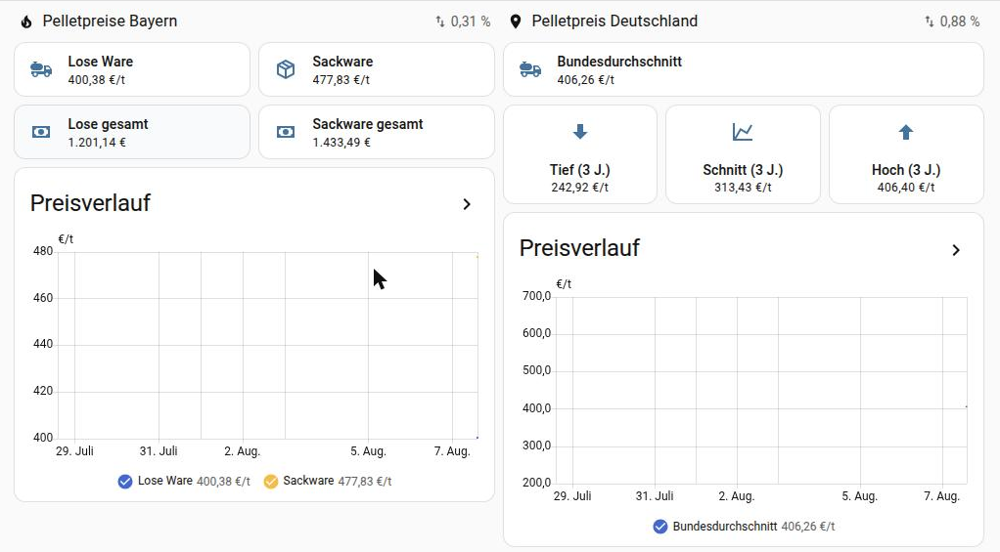

# Pelletpreise für Home Assistant

Holt die aktuellen Marktpreise für Holzpellets von [heizpellets24.de](https://www.heizpellets24.de/pelletpreise)
und legt sie als Sensoren an — für Deutschland insgesamt oder für ein einzelnes
Bundesland, mit **lose Ware** und **Sackware** getrennt.



## Was die Integration liefert

Pro eingerichteter Region entsteht ein Gerät mit diesen Sensoren:

| Sensor | Einheit | Gilt für |
| --- | --- | --- |
| Lose Ware | €/t | alle Regionen |
| Lose Ware pro kg | €/kg | alle Regionen |
| Lose Ware Gesamtpreis ¹ | € | alle Regionen |
| Lose Ware Änderung zur Vorwoche | % | alle Regionen |
| Sackware | €/t | nur Bundesländer |
| Sackware pro kg | €/kg | nur Bundesländer |
| Sackware Gesamtpreis | € | nur Bundesländer |
| Sackware Änderung zur Vorwoche | % | nur Bundesländer |
| Lose Ware Tiefstpreis / Höchstpreis (beobachtet) ² | €/t | alle Regionen |
| Sackware Tiefstpreis / Höchstpreis (beobachtet) ² | €/t | nur Bundesländer |
| Tiefstwert / Höchstwert / Durchschnitt 3 Jahre | €/t | nur Deutschland |
| Differenz zu vor 3 Monaten | €/t | nur Deutschland |
| Günstigstes / teuerstes Bundesland (lose, Sackware) ³ | €/t | nur Deutschland |

¹ Als einziger Sensor enthält er die selbst eingetragene
[Einblaspauschale](#einblaspauschale) — sofern eine eingetragen ist.
² Eigene Aufzeichnung dieser Installation, keine Angabe der Quelle — siehe
[Tiefst- und Höchstpreise](#tiefst--und-höchstpreise).
³ Muss unter *Konfigurieren* eingeschaltet werden — siehe
[Bundesländer vergleichen](#bundesländer-vergleichen).

Mehrere Regionen parallel sind möglich — einfach die Integration mehrfach
hinzufügen. Alle Preise verstehen sich **inklusive Mehrwertsteuer und
Lieferung**; bei loser Ware kommt herstellerseitig die Einblaspauschale hinzu.
Die lässt sich bei der Einrichtung eintragen und fließt dann in den Sensor
*Lose Ware Gesamtpreis* ein — siehe [Einblaspauschale](#einblaspauschale).

## Installation

### Über HACS (empfohlen)

1. HACS → Dreipunktmenü → **Benutzerdefinierte Repositories**
2. Repository: `https://github.com/chicohaager/ha-pelletpreise`, Kategorie: **Integration**
3. „Pelletpreise" herunterladen, Home Assistant neu starten
4. **Einstellungen → Geräte & Dienste → Integration hinzufügen → Pelletpreise**

### Von Hand

Den Ordner `custom_components/pelletpreise` in das Konfigurationsverzeichnis
von Home Assistant kopieren (dorthin, wo auch `configuration.yaml` liegt), dann
neu starten.

Benötigt **Home Assistant 2025.3 oder neuer**.

> In der HACS-Übersicht steht statt des Symbols ein Platzhalter. Das ist
> normal: HACS holt die Symbole aus dem zentralen Katalog
> brands.home-assistant.io, in dem selbst installierte Integrationen nicht
> stehen. Home Assistant selbst zeigt das mitgelieferte Symbol (ab 2026.3) —
> unter *Einstellungen → Geräte & Dienste → Pelletpreise*.

## Einrichtung

Im Dialog werden drei Dinge abgefragt:

- **Region** — „Deutschland" oder eines der 16 Bundesländer.
- **Bestellmenge** — wirkt **ausschließlich** auf die hochgerechneten
  Gesamtpreise. Der Marktpreis je Tonne ändert sich dadurch nicht.
- **Einblaspauschale** — was der eigene Händler je Lieferung fürs Einblasen
  berechnet. Vorgabe 0 €.

Alles lässt sich später über **Konfigurieren** am Eintrag ändern; die Änderung
wirkt sofort, ohne Neustart. Im Eintrag für Deutschland steht dort zusätzlich
der Schalter [Bundesländer vergleichen](#bundesländer-vergleichen).

### Einblaspauschale

heizpellets24.de schreibt unter seine Preise: *„Preis inkl. MwSt. und Lieferung
(lose Pellets **zzgl.** Einblaspauschale)"* — die Pauschale ist im Marktpreis
also **nicht** enthalten, und die Quelle nennt keinen Betrag, weil er je
Händler verschieden ist. Deshalb steht hier keine Voreinstellung außer 0: eine
„übliche" Zahl wäre geraten und stünde am Ende ununterscheidbar im Gesamtpreis.

Wer seinen Betrag einträgt, bekommt ihn **einmal je Bestellung** auf den
Gesamtpreis der losen Ware gerechnet:

| | mit 0 € | mit 45 € |
| --- | --- | --- |
| Lose Ware | 400,38 €/t | 400,38 €/t |
| Lose Ware pro kg | 0,4004 €/kg | 0,4004 €/kg |
| **Lose Ware Gesamtpreis** (6.000 kg) | **2.402,28 €** | **2.447,28 €** |
| Sackware Gesamtpreis (6.000 kg) | 2.867,16 € | 2.867,16 € |

Drei Dinge sind dabei Absicht:

- **Nur der Gesamtpreis der losen Ware ändert sich.** Die Werte je Tonne und je
  Kilogramm bleiben unangetastet — das sind Marktpreise der Quelle, keine
  Rechnung. Wäre die Pauschale dort eingemischt, spränge der Preisverlauf,
  sobald jemand seine Bestellmenge ändert.
- **Sackware bekommt sie nicht.** Die kommt auf Paletten und wird nicht
  eingeblasen. Ist eine Pauschale eingetragen, sagt der Sackware-Sensor das im
  Attribut `hinweis_einblaspauschale` ausdrücklich dazu.
- **Der eigene Anteil bleibt sichtbar.** Der Sensor *Lose Ware Gesamtpreis*
  führt `warenwert_eur` und `einblaspauschale_eur` getrennt auf, und
  `berechnung` schreibt dazu, dass die Pauschale selbst eingetragen wurde und
  nicht von heizpellets24.de stammt.

Bestehende Einrichtungen ändern sich nicht: ohne Eintrag steht die Pauschale
auf 0, und der Gesamtpreis bleibt auf den Cent derselbe wie vorher.

## Tiefst- und Höchstpreise

Die Sensoren mit **(beobachtet)** halten den niedrigsten und den höchsten
Preis fest, den *diese Installation selbst gesehen hat* — je Region und
getrennt für lose Ware und Sackware. Sie kosten keinen zusätzlichen Abruf und
sind ab der Einrichtung da.

Wichtig ist, was sie **nicht** sind: eine Angabe von heizpellets24.de. Die
Quelle führt Tief- und Höchstwerte ausschließlich auf ihrer Deutschland-Seite
und nur über drei Jahre; für die Bundesländer gibt es dort nichts dergleichen
(nachgemessen — der Live-Test
`test_die_bundeslandseiten_fuehren_keine_langfristwerte` prüft genau das, mit
der Deutschland-Seite als Gegenprobe). Deshalb steht „(beobachtet)" im Namen
und in den Attributen:

- `beobachtet_seit` — seit wann aufgezeichnet wird. Ohne diese Angabe ist der
  Wert nicht deutbar: 380 €/t nach drei Tagen heißt etwas anderes als 380 €/t
  nach zwei Jahren.
- `gesehen_am` — wann der Rekord **zuerst** erreicht wurde. Bleibt bei
  gleichem Preis stehen, statt täglich mitzuwandern.

Der Wert überdauert Neustarts und auch Ausfälle der Quelle. Führt die Quelle
für ein Bundesland gerade keine Sackware, bleibt der bisherige Rekord stehen —
er war einmal wahr und wird es nicht dadurch weniger.

Zum Neuanfangen gibt es den Dienst **`pelletpreise.extremwerte_zuruecksetzen`**
(*Entwicklerwerkzeuge → Aktionen*, oder am Sensor selbst). Er verwirft die
Aufzeichnung der angesprochenen Sensoren und beginnt beim aktuellen Preis von
vorn.

## Bundesländer vergleichen

Im Eintrag für **Deutschland** lassen sich unter *Konfigurieren* zwei
Sensorpaare zuschalten: **günstigstes** und **teuerstes Bundesland**, je für
lose Ware und Sackware. Der Zustand ist der Preis in €/t, das Bundesland steht
im Attribut `bundesland` — dazu die vollständige Liste aller Länderpreise
(`preise_je_bundesland`), die Spanne, ein etwaiger Gleichstand (`gleichauf`)
und, bei Sackware, die Länder ohne Angebot (`ohne_angebot`).

Der Vergleich ist **standardmäßig aus**, und das aus einem handfesten Grund:
die Deutschland-Seite liefert ihre Bundesland-Tabelle nicht mit (die füllt
JavaScript nach), also müssen alle 16 Landesseiten einzeln geholt werden. Das
sind **16 zusätzliche Abrufe je Aktualisierung**, also 32 am Tag — Last auf
einer fremden Website, die niemand ungefragt bekommt.

Schlägt auch nur eine der 16 Seiten fehl, bleiben beide Sensoren ohne Wert und
der Grund steht im Protokoll. „Das günstigste von 15" wäre eine Aussage über
eine Menge, die gar nicht vollständig geprüft wurde — und sähe genauso aus wie
das echte Ergebnis.

Der Bundesdurchschnitt der Deutschland-Seite ist übrigens **nicht** der
Mittelwert dieser 16 Werte: die Quelle bildet ihn nach eigener Angabe je
Postleitzahl. Beide Zahlen liegen nah beieinander (am 08.08.2026: 406,51 €/t
gegenüber 406,16 €/t), sind aber nicht dasselbe.

## Wie genau sind die Zahlen?

Diese Integration liest exakt das, was heizpellets24.de auf seinen öffentlichen
Preisseiten anzeigt. Dazu gerechnet wird genau eine Zahl, und nur wenn du sie
selbst einträgst: die [Einblaspauschale](#einblaspauschale). Fünf Punkte sind
wichtig:

- **Der Preis ist ein Marktdurchschnitt, kein Angebot.** Die Quelle bildet ihn
  je Region aus dem günstigsten Händlerangebot je Postleitzahl.
- **Bezugsgröße ist eine Gesamtabnahme von 6.000 kg.** Der Gesamtpreis wird von
  dort aus **linear** auf deine Menge hochgerechnet. Echte Angebote sind
  mengenabhängig: kleinere Bestellungen sind je Tonne teurer. Der Sensor sagt
  das in seinen Attributen (`berechnung`) dazu — nimm die Zahl als
  Größenordnung, nicht als Kalkulation.
- **Die Einblaspauschale ist deine Zahl, nicht die der Quelle.** Sie steht
  deshalb im Sensor getrennt neben dem Warenwert und wird im Attribut
  `berechnung` als eigene Eingabe benannt — damit sie später niemand für einen
  gelesenen Marktwert hält.
- **Feiner als Bundesland geht es nicht.** Eine Postleitzahl wird bewusst
  *nicht* abgefragt: die Quelle liefert auf ihren öffentlichen Seiten keine
  PLZ-genauen Preise, und eine PLZ, die nichts bewirkt, würde eine Genauigkeit
  vortäuschen, die es nicht gibt.
- **Einzelne Händlerangebote gibt es nicht.** Damit ist auch keine Spanne
  „günstigster bis teuerster Anbieter" möglich und keine echte
  Einblaspauschale: die öffentliche Seite nennt je Region nur eine Zahl und
  keinen Pauschalbetrag, und die Endpunkte mit den Angeboten sperrt die
  `robots.txt` von heizpellets24.de für alle Clients.

Geht bei der Quelle etwas kaputt oder ändert sich das Seitenformat, werden die
Sensoren **nicht verfügbar** und die Integration meldet im Protokoll, welcher
Teil der Seite gefehlt hat. Es wird in keinem Fall ein Ersatz- oder Altwert
angezeigt — ein falscher Preis wäre schlimmer als gar keiner.

## Dashboard-Karten

Fertige Karten zum Einfügen liegen unter [`dashboard/`](dashboard/):

- [`karte-bundesland.yaml`](dashboard/karte-bundesland.yaml) — lose Ware und Sackware, dazu die beobachteten Extremwerte
- [`karte-deutschland.yaml`](dashboard/karte-deutschland.yaml) — Bundesdurchschnitt, Drei-Jahres-Einordnung und Bundesland-Vergleich

Die Entitäts-IDs darin sind **Beispiele**. Home Assistant bildet sie bei der
**ersten** Registrierung aus dem übersetzten Sensornamen und ändert sie danach
nie wieder. Zwei Abweichungen sind deshalb normal:

- Ältere Einrichtungen behalten die Namen von damals — dort kann derselbe
  Sensor `sensor.pelletpreise_deutschland_lose_tonne` heißen, wo eine heute
  angelegte Installation `sensor.pelletpreise_deutschland_lose_ware` hat.
- Ist das Gerät einem Bereich zugeordnet, steht dessen Name vorn:
  `sensor.sonstiges_pelletpreise_deutschland_lose_ware`.

Die eigenen IDs stehen unter *Einstellungen → Geräte & Dienste → Pelletpreise →
Gerät* oder in den Entwicklerwerkzeugen unter *Zustände*.

Der Preisverlauf füllt sich erst mit der Zeit und reicht nur so weit zurück,
wie der Recorder Daten aufbewahrt (Standardeinstellung: 10 Tage).

## Aktualisierung

Alle 12 Stunden. Die Quelle aktualisiert einmal täglich — häufigeres Abrufen
brächte keine neuen Daten und würde eine fremde Website ohne Nutzen belasten.
Pro Region und Abruf ist es genau **eine** Anfrage; nur mit eingeschaltetem
[Bundesland-Vergleich](#bundesländer-vergleichen) kommen im Deutschland-Eintrag
16 weitere dazu, gedrosselt auf vier gleichzeitig.

Verwendet werden ausschließlich die regulären, öffentlichen Preisseiten, die
`robots.txt` von heizpellets24.de für alle Clients freigibt. Die dort gesperrten
Datenendpunkte werden bewusst nicht angefasst.

## Fehler melden

Bitte über *Einstellungen → Geräte & Dienste → Pelletpreise → Dreipunktmenü →
**Diagnose herunterladen*** die Diagnosedatei anhängen. Sie enthält den letzten
Fehlertext und die gelesenen Werte, aber keine persönlichen Daten — die
Integration braucht weder Zugangsdaten noch eine Adresse.

## Entwicklung

```bash
python -m pytest              # Offline-Tests gegen gespeicherte Seiten
python -m pytest -m live      # zusätzlich gegen die echte Website

pip install pytest-homeassistant-custom-component   # braucht Python 3.13
python -m pytest tests/test_sensoren_ha.py -o asyncio_mode=auto
```

Die Offline-Tests prüfen den Parser gegen echte, abgespeicherte Seiten — die
erwarteten Zahlen stammen aus der im Browser gerenderten Tabelle der Quelle.
Dazu kommen Negativtests: kaputte, leere und falsche Seiten müssen zu einem
klaren Fehler führen und dürfen keinen Wert liefern.

Der Live-Test ruft alle 16 Bundesländer plus Deutschland ab und schlägt an,
sobald sich das Seitenformat ändert. Er läuft zusätzlich wöchentlich in der
GitHub-Action, damit so eine Änderung auffällt, bevor jemand ein Ticket
aufmacht.

Die dritte Suite (`tests/test_sensoren_ha.py`) startet ein echtes Home
Assistant und prüft, was die beiden anderen nicht sehen können: ob die
Entitäten überhaupt entstehen, ob der beobachtete Rekord einen Neustart
übersteht, ob der Dienst zum Zurücksetzen greift und ob ein fehlgeschlagener
Bundesland-Abruf wirklich zu „nicht verfügbar" führt statt zu einem
Teilergebnis. Ohne das Zusatzpaket überspringt sie sich.

## Lizenz

MIT — siehe [LICENSE](LICENSE).

Die Preisdaten stammen von heizpellets24.de. Dieses Projekt steht in keiner
Verbindung zu HeizPellets24.
